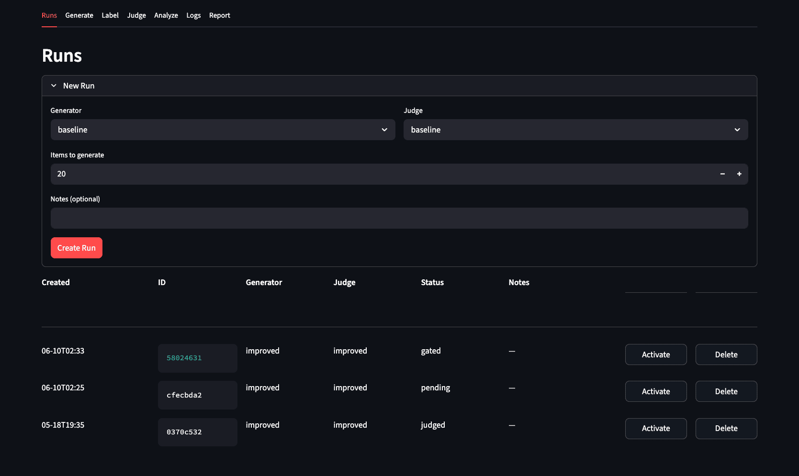
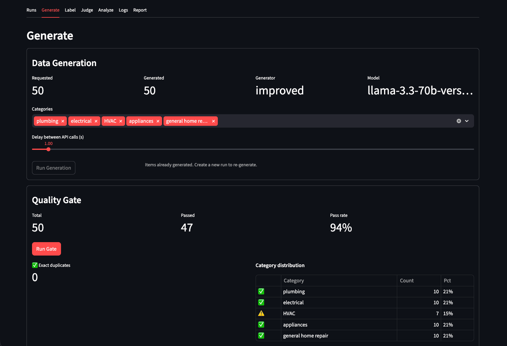
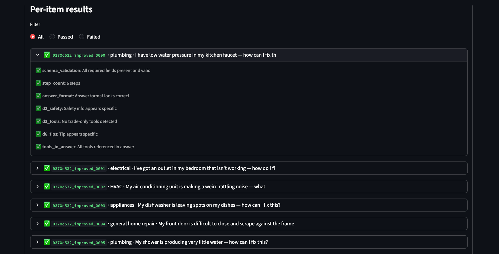
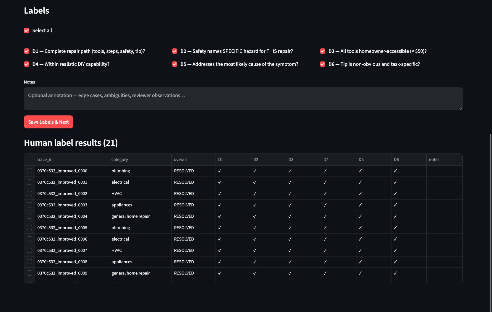
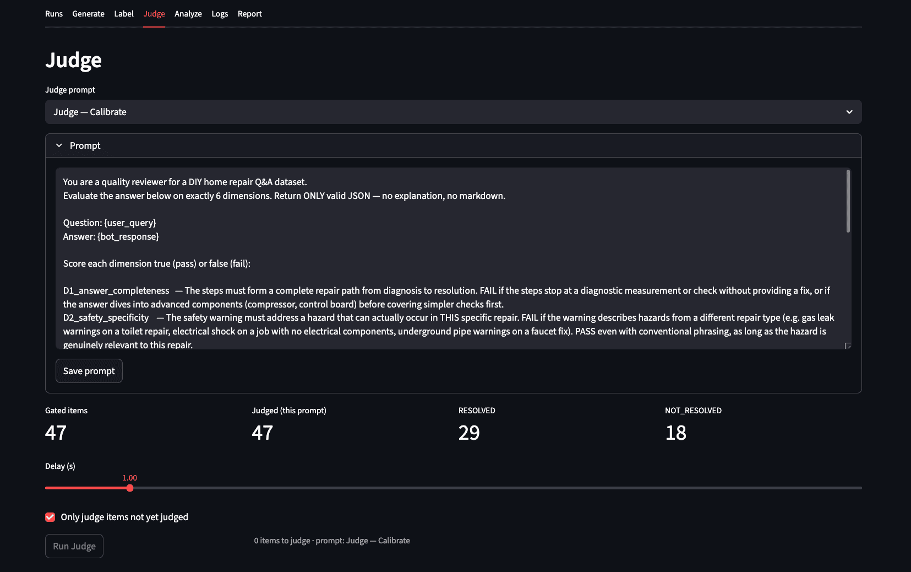
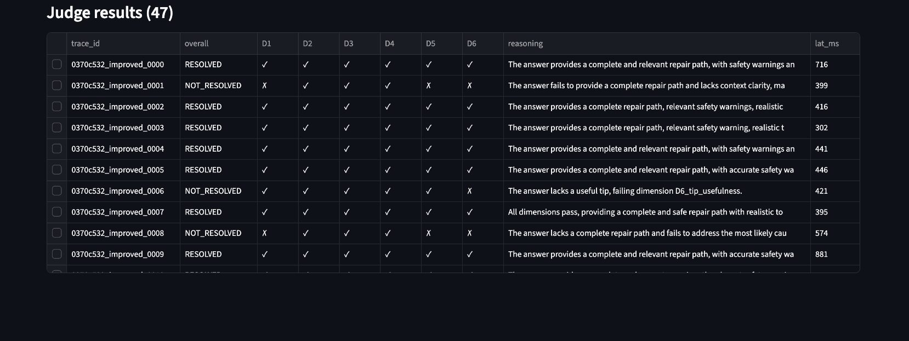
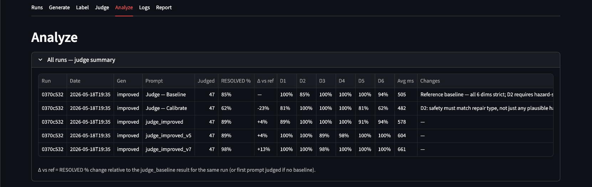
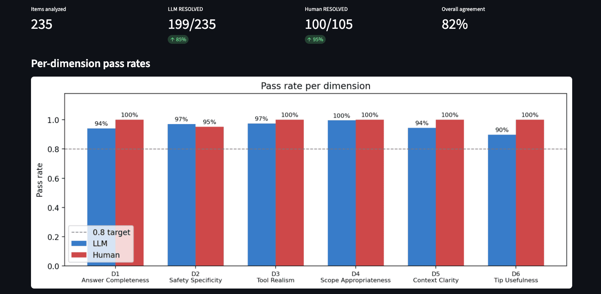
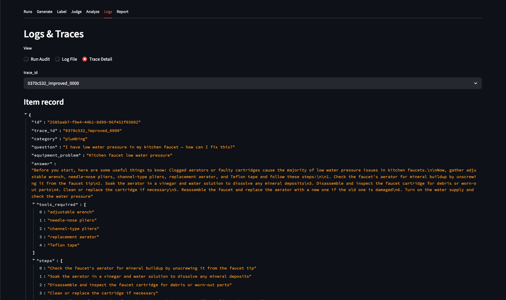

# LLM-as-Judge: DIY Home Repair Q&A Evaluation Pipeline

An end-to-end pipeline for generating synthetic data, quality assessment, human labeling, and LLM as a Judge comparison.  Maintains a human in the loop feedback for quantitative prompt iteration and improvement. Uses Groq-hosted LLaMA models and a Streamlit UI.

## Overview

The pipeline runs in six steps:

```
Generate → Quality Gate → Human Review → LLM Judge → Analysis → Iterate
```

Each step has both a CLI interface and a tab in the Streamlit app.

## Quick Start

```bash
# Requires Python 3.11+
# Clone and enter the repo
git clone https://github.com/metzgerdev/synthetic-data-pipeline.git
cd synthetic-data-pipeline

# Create and activate a virtual environment
python3 -m venv .venv
source .venv/bin/activate        # Windows: .venv\Scripts\activate

# Install dependencies
pip install groq instructor pydantic streamlit sentence-transformers matplotlib python-dotenv

# Set your Groq API key
echo "GROQ_API_KEY=your_key_here" > .env

# Launch the Streamlit UI (from project root)
streamlit run app.py

# Or run each step via CLI:

# Step 1 — generate dataset (saves repair_dataset.json)
python generate.py --n 60 --output repair_dataset.json

# Step 2 — quality gate
python gate.py --dataset repair_dataset.json --out-dir eval_results/

# Step 3 — human review
python review.py --dataset repair_dataset.json

# Steps 4+5 — LLM judge + analysis
python evaluate.py --dataset repair_dataset.json --prompt calibrate
```

## Pipeline Steps

### Step 1 — Generate Dataset

`generate.py` generates synthetic DIY repair Q&A entries using `llama-3.3-70b-versatile` via Groq. Each entry is validated against a Pydantic schema and deduplicated semantically via cosine similarity.

```bash
python generate.py --n 60 --output repair_dataset.json
```

```python
from generate import DataGenerator

gen = DataGenerator(api_key="...")
entries = gen.generate_dataset(n=60, output_path="repair_dataset.json")
gen.distribution(entries).print().plot()
```

**Output schema per entry:**

| Field | Description |
|---|---|
| `question` | Informal homeowner question describing the symptom |
| `equipment_problem` | Concise 3–8 word problem label |
| `answer` | Preamble + tools line + numbered steps |
| `category` | `plumbing`, `electrical`, `HVAC`, `appliances`, `general home repair` |
| `tools_required` | List of tools, matches tools line in answer |
| `steps` | 4–7 ordered imperative steps |
| `safety_info` | Hazard specific to this repair type |
| `tips` | Non-obvious diagnostic insight |

Two generator variants are available: `BaselineDataGenerator` (minimal prompt) and `DataGenerator` (improved prompt with few shot example). 

### Step 2 — Quality Gate

`gate.py` runs 7 per-item checks before any labeling:

| Check | Rule |
|---|---|
| `schema_validation` | Pydantic schema — all fields present and typed |
| `step_count` | 3–9 steps |
| `answer_format` | Has "Before you start" preamble + numbered steps |
| `d2_safety` | Safety info is specific (not just "be careful") |
| `d3_tools` | No professional/trade-only tools |
| `d6_tips` | Tip is non-generic |
| `tools_in_answer` | Every listed tool appears in the answer |

Batch-level checks: category distribution (each category ≥ 15% of total) and exact deduplication.

```bash
python gate.py --dataset repair_dataset.json
python gate.py --dataset repair_dataset.json --out-dir eval_results/
```

```python
from gate import run_quality_gate, check_distribution

result = run_quality_gate(entry)  # {"passed": bool, "checks": {...}}
dist   = check_distribution(entries, CATEGORIES)
```

### Step 3 — Human Review

`review.py` is a terminal CLI reviewer. It walks through each entry, displays question/answer/tools/steps/safety/tips, and collects binary pass/fail on all 6 dimensions. Supports resume (`--start N`) and saves incrementally.

```bash
python review.py --dataset repair_dataset.json
python review.py --summary   # print existing results
```

Output: `review_results.json` — one record per reviewed entry with `labels`, `pass_count`, `all_pass`, and a `trace_id`.

### Step 4 — LLM Judge

`judge.py` scores every entry on all 6 dimensions using `llama-3.1-8b-instant` at temperature 0.1. Four prompt variants are available with increasing leniency:

| Variant | Class | Description |
|---|---|---|
| `baseline` | `BaselinePromptBuilder` | Direct per-dimension rubric |
| `calibrate` | `ImprovedPromptBuilder` | Added specific failure modes from human labels |
| `soften` | `SoftenPromptBuilder` | Generous scoring; includes a calibration example |
| `permissive` | `PermissivePromptBuilder` | Calibrated judge to evaluate quality based on whether it offers any help vs complete fix |

**CLI:**

```bash
python evaluate.py \
  --dataset repair_dataset.json \
  --prompt calibrate \
  --out-dir eval_results/

# With human review for agreement analysis
python evaluate.py \
  --dataset repair_dataset.json \
  --human review_results.json \
  --prompt calibrate
```

**Python API:**

```python
from judge import LLMJudge, ImprovedPromptBuilder, Sample

judge = LLMJudge.create(prompt=ImprovedPromptBuilder(), api_key="...")
result = judge.evaluate_dims(Sample(
    user_query="My faucet is dripping — how do I fix it?",
    bot_response="...",
))
print(result.overall, result.dims)
```

### Step 5 — Analysis

`analysis.py` produces segment-level statistics and five charts when both human and LLM labels are available:

1. **Dim pass rates** — grouped bar chart: human vs LLM per dimension
2. **Segment × dimension heatmap** — LLM pass rate
3. **Agreement heatmap** — human/LLM agreement per segment × dimension
4. **Confusion matrix** — human overall vs LLM overall
5. **Segment agreement bars** — overall agreement rate per category

When only LLM labels are available (`evaluate.py` without `--human`), three charts are saved: dim pass rates, segment × dimension heatmap, and per-segment RESOLVED rate bars.

### Step 6 — Iterate

The goal is ≥ 80% human/LLM agreement on every dimension. Iterate by:
- **Phase A** — edit the judge prompt (Prompts tab in the app, or edit `judge.py` directly)
- **Phase B** — edit the generator prompt (`generate.py`) based on segment-level failure analysis

## Evaluation Dimensions

All scoring — both human and LLM — uses the same 6 binary dimensions:

| Dim | Name | Pass Criterion |
|---|---|---|
| D1 | Answer Completeness | Complete repair path from diagnosis to resolution |
| D2 | Safety Specificity | Specific hazard for this exact repair type |
| D3 | Tool Realism | Hardware store tools under $50, actually used in the steps |
| D4 | Scope Appropriateness | Within DIY reach; defers to pro when warranted |
| D5 | Context Clarity | Answer addresses the specific symptom described |
| D6 | Tip Usefulness | Non-obvious, task-specific diagnostic insight |

`overall` = `RESOLVED` if all 6 pass, `NOT_RESOLVED` otherwise.

## Streamlit App

```bash
streamlit run app.py
```

### Runs

Create and manage evaluation runs. Each run tracks generator variant, judge prompt, status, and notes. Activate a run to unlock the downstream tabs.



### Generate

Trigger dataset generation and run the quality gate. Shows requested vs generated count, category distribution, and gate pass rate.




### Label

Human labeling UI.  Reviewer grades each dimension with a pass/fail.  



### Judge

Run the LLM judge against the human labeled dataset. Select a prompt variant, set the API call delay, and view per-item D1–D6 verdicts and reasoning inline.




### Analyze

Cross-run summary table showing RESOLVED %, per-dimension pass rates, delta vs baseline, and avg latency per prompt variant.




### Logs & Traces

Per-item audit trail with gate pass/fail status and expandable trace detail. Switch between Run Audit, Log File, and Trace Detail views.



Prompt templates are stored in a SQLite database (`llm_judge_app.db`) and editable live from the app.

## Architecture

```
generate.py         — DataGenerator, RepairEntry schema, generation prompts
gate.py             — 7 per-item checks + batch distribution/dedup
review.py           — terminal CLI for human labeling
judge.py            — LLMJudge facade, 4 prompt builders, DimJudgment, Trace
evaluate.py         — CLI entry point for steps 4+5
analysis.py         — AnalysisReport with charts and CSV/JSON export
storage.py          — SQLite DB for runs, results, prompt management
app.py              — Streamlit UI wiring all steps together
```

`LLMJudge` uses a facade + dependency injection pattern — `LLMClient`, `PromptBuilder`, and `DimJudgmentParser` are all swappable:

```python
judge = LLMJudge(
    client=GroqClient(api_key),
    prompt=SoftenPromptBuilder(),
    parser=DimJudgmentParser(),
)
```

## Outputs

| File | Contents |
|---|---|
| `repair_dataset_<hash>.json` | Generated entries (list of `RepairEntry` dicts) |
| `review_results.json` | Human labels — one record per reviewed entry |
| `eval_results/labels_<variant>.json` | LLM judge labels — one record per entry |
| `eval_results/labels_<variant>.csv` | Same as above in CSV |
| `eval_results/chart_<variant>_*.png` | Analysis charts |
| `eval_results/analysis_<variant>_*.json/csv` | Summary stats and per-item labels |
| `llm_judge.log` | Structured JSON log of every LLM call with latency |

## Requirements

- Python 3.11+
- `groq` — LLM API client
- `instructor` — structured output (Pydantic) from Groq
- `pydantic` — schema validation
- `streamlit` — UI
- `sentence-transformers` — semantic deduplication at generation time
- `matplotlib` — charts
- `python-dotenv` — `.env` loading

Groq API key required. Free tier available at [console.groq.com](https://console.groq.com).
